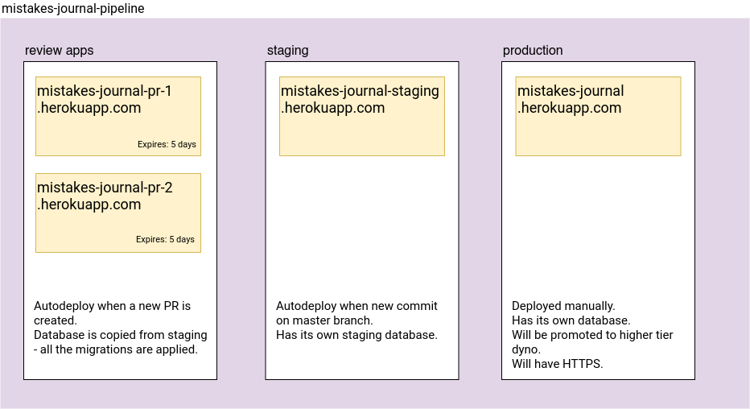

# Mistakes Journal - heroku deployment
The architecture created for Heroku uses Heroku Pipelines and mostly automatic deployment.

There are configured 3 pipes:
1. Review Apps
2. Staging
3. Production

Each of the pipe have a special purpose. The Review Apps will be used among the team to test each other's
Pull Request. When a new PR is created, a new application is build. The application URL is `mistakes-journal
-pr-<PR NUMBER>.herokuapp.com`. The application will automatically be destroyed in 5 days.
When it comes to its database, the database will be copied from staging database. Of course, migrations won't
affect staging environment, so it is safe - only data and tables will be copied.

Second pipe, staging, is a pipe that will be mostly used during showcase of application. It is automatically
build when a new change is merged into `master` branch on git. This pipe also has its own database.

Last, but not least, there is pipe for production. Applications deployed here will be deployed manually, due the fact
that they require additional setup.
